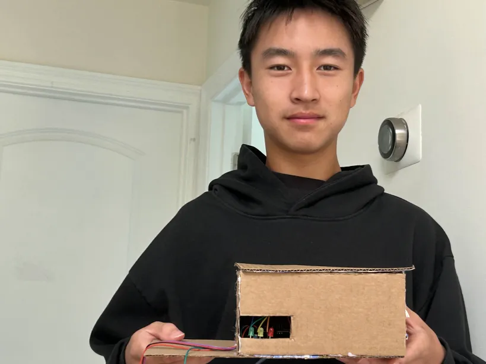
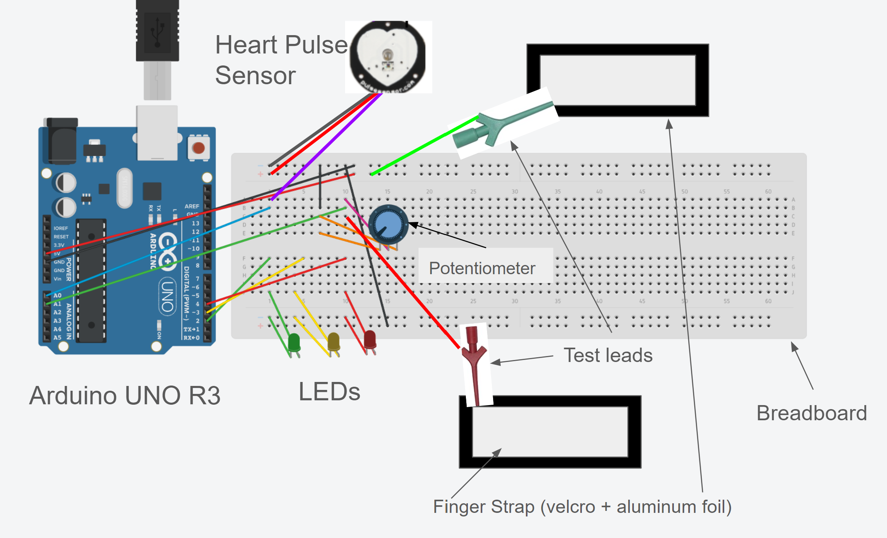

# Lie Detector Project
I did a lie detector for my summer 2024 robotics project at BlueStamp Engineering. It required me to build a device that would read the skin's resistance and heart rate, which changes when under stress and possibly during a person's lying. Some challenges included calibrating the circuit and integrating all components together while integrating the components together was definitely the most remarkable success.

| **Engineer** | **School** | **Area of Interest** | **Grade** |
|:--:|:--:|:--:|:--:|
| Henry Y | Sage Hill | Mechanical Engineering | Incoming Sophomore


  
# Final Milestone

<iframe width="560" height="315" src="https://www.youtube.com/embed/cNwu9Yx4r1g?si=nlBvfURgD2xEgk_E" title="YouTube video player" frameborder="0" allow="accelerometer; autoplay; clipboard-write; encrypted-media; gyroscope; picture-in-picture; web-share" referrerpolicy="strict-origin-when-cross-origin" allowfullscreen></iframe>

I have worked substantially to the extent that I custom-made a housing for my Arduino UNO R3 and breadboard. I also replaced the old heart rate sensor with a custom-made inbuilt heart rate sensor. Additionally, the 10k ohm potentiometer is upgraded to a 200k ohm potentiometer, which gives much finer adjustments. Thus, these enhance the usability of my lie detector project towards completion both physically and functionally. Integrating new components into the existing circuit, like the heart rate sensor and the 200k ohm potentiometer, was quite a challenge to me. It took so many troubleshooting efforts and coding adjustments before all the devices would work in harmony. But conquering those challenges was my greatest triumph. Indeed, seeing the project evolve and working exactly the way it is intended to has been rewarding. It has taught me the importance of persistence and adaptability in problem-solving.

I have built up a good knowledge base in circuit design, Arduino coding, and practical application of sensors in electronics. Troubleshooting techniques and designing custom housing to give a professional finish at the end of a project were also some of the skills acquired. These skills did not only help me empower myself to complete this lie detector project but also gave me the requisite confidence to tackle more complex projects in the future. This will let me further develop principles learned at BSE and delve deeper into advanced electronics and programming. I would like to learn about more complex sensors and how they can be applied in bigger systems. Furthermore, I am highly interested in learning more about data analysis and machine learning to be able to design more intelligent and responsive devices. I would like to continue to challenge myself with even more ambitious projects that would push my current skill level.

# Second Milestone

<iframe width="560" height="315" src="https://www.youtube.com/embed/Q7CZFGnQ5iE?si=k9j5a3OE7kBv_rPC" title="YouTube video player" frameborder="0" allow="accelerometer; autoplay; clipboard-write; encrypted-media; gyroscope; picture-in-picture; web-share" referrerpolicy="strict-origin-when-cross-origin" allowfullscreen></iframe>

I have done a lot towards the completion of my project, which is the lie detector. The main work I have done so far is on the technical development of my project. I added a potentiometer in the system so I could adjust and vary the values of resistors. This brings more flexibility and finer adjustment to the circuit, so it's more sensitive, and thus able to respond to variations in skin resistance. Adding three LEDs, namely green, yellow, and red, was also done to show the indication of voltage values when they increase. These LEDs provide instant, clear indication of possible lies: green if the levels are normal, yellow if they are at a moderate increase, and red if they are at a high increase in voltage. I have also changed the code to support these new features so that the LEDs light accordingly, based on the voltage readings. What has really surprised me about this project is the amount of progress I have made and new techniques that I have tried. I never expected to learn and implement all that in such a short time. It was very rewarding to add new components like the potentiometer and LEDs, making them run together. But more engaging was observing changes in the circuit and its code and their impact on the final functional working and accuracy of the lie detector.

One major challenge that I overcame was adding in the potentiometer. The potentiometer used was a 10k one while the old resistor I was using was 1MΩ. This disparity caused the voltage values to always be very low and hard to get proper readings initially. This meant that I had to tune the circuit and the code to work with these now lower values that this 10k potentiometer was giving, which took some trial and error. By defeating this obstacle, I've learned the importance of matching values of components together and the need for tuning in a circuit for optimal performance. There are a few remaining tasks before my final milestone is complete. I will start by adding a heart rate or pulse measurement method so that there could be another signal showing stress or lying. This shall include integrating a heart rate sensor into the existing circuit and updating the code to read and process heart rate data. Second, I will create a house or case for the project to improve the look of the wiring by making sure all of the wiring is hidden, much neater. In so doing, it will give the lie detector professional looks that an end user would want. I will also go back and refine the code and fine-tune the sensors so the lie detector can be as correct and reliable as possible.

# First Milestone

<iframe width="560" height="315" src="https://www.youtube.com/embed/AADOw3bXJUM?si=9ewBvpXHIUCiqQOu" title="YouTube video player" frameborder="0" allow="accelerometer; autoplay; clipboard-write; encrypted-media; gyroscope; picture-in-picture; web-share" referrerpolicy="strict-origin-when-cross-origin" allowfullscreen></iframe>

For my first milestone, I completed the base construction of a machine and some straps for the fingers showing how changes in resistance in my skin will increase the voltage read and printed by the Arduino. The setup uses a voltage divider circuit wherein the higher the resistance, the more voltage absorbed by the resistor. I wired it all together, using an Arduino UNO R3 to be the brain of the project that would process this data and spit out an output. Additionally, I used a breadboard to straighten everything out and to keep all the components in their correct places, and two finger straps made of Velcro and aluminum foil, connected to the fingers in order to get readings of skin resistance. 1 Megaohm (1MΩ) Resistor was used and crucial for the voltage divider circuit, as it provides the ability to measure skin resistance accurately. The 1MΩ resistor is then put in series with the skin resistance being measured through the finger straps. One end of this setup goes to the 5V pin on the Arduino, and the other to an analog input pin, A0. The midpoint, between the resistor and skin resistance, goes to ground (GND). 

During the course of the project, I used a variety of resistor values and had to find the perfect one. I recorded the lowest voltage readings when using resistors of values of lower resistance. This is because it allows more current to flow through them; hence, there will be a lower voltage drop across the resistor. The readings were the highest when I used the 1MΩ resistor. This could be because the higher the resistance, the more it restricts current flow, hence the larger the voltage drop across the resistor. It is the 1MΩ resistor that gave the maximum values obtained so far, hence being the most appropriate for detecting changes in skin resistance. Again, with higher voltage values, I easily noticed changes since these values were more accurate. The higher voltage values gave a finer line of demarcation between the different ranges of skin resistance and thus facilitated the correct detection of a stress response that might indicate lying. In the future I plan to use LEDs to indicate wether the person in fingerstraps if lying or not.

# Schematics 



# Code
Here's where you'll put your code. The syntax below places it into a block of code. Follow the guide [here]([url](https://www.markdownguide.org/extended-syntax/)) to learn how to customize it to your project needs. 

```c++
void setup() {
  // put your setup code here, to run once:
  Serial.begin(9600);
  Serial.println("Hello World!");
}

void loop() {
  // put your main code here, to run repeatedly:

}
```

# Bill of Materials


| **Part** | **Note** | **Price** | **Link** |
|:--:|:--:|:--:|:--:|
| Arduino UNO R3 | Microcontroller board | $27.60 | <a href="https://www.amazon.com/Arduino-A000066-ARDUINO-UNO-R3/dp/B008GRTSV6"> Link </a> |
|:--:|:--:|:--:|:--:|
| Breadboard | For organizing components | $8.99 for 3 | <a href="https://www.amazon.com/EL-CP-003-Breadboard-Solderless-Distribution-Connecting/dp/B01EV6LJ7G/ref=sr_1_5?crid=PFNV9D4GYGUN&dib=eyJ2IjoiMSJ9.YB1cQnPdW7IDeZYbUd02IAwttxypLcFsu9cyvR7_BHc2cEp4uX_BoFdB-kGIGiSG8IBm7Y5SUgp0L0VV9HPkC218PlLOeriZ1zvfb6zWGZ6Xph5pBxJnmD_M0qaA-LB4Uyw1qJu3TEx2aV2v6cPFmei_rBZ0Q0_WCcPPejfYrNochsVRM4WTexrge3UWARLFXRqX1y11bIrBosAmnE5kk09IL9Z8v8lvjgisegNgiiRNJjWtU43C_r54_ugFS7iFyySNLNxlS8KB95WwbowaZmPMhxmmDpCOyCDPlqV4ldQ.QTqR1Na2J15ZletXvFLOr5wnuIBxvHEvxdgvKThyuoM&dib_tag=se&keywords=Breadboard&qid=1722971435&s=electronics&sprefix=breadboard%2Celectronics%2C168&sr=1-5"> Link </a> |
|:--:|:--:|:--:|:--:|
| Potentiometer 200K | Adjusts resistor values | $12.99 for 150 piece kit | <a href="https://www.amazon.com/BOJACK-Variable-Resistor-Potentiometer-Assortment/dp/B07WHJMVR4/ref=sr_1_4?dib=eyJ2IjoiMSJ9.dkj5LLbVPRfxx_l4IGuVPALkvR8qM04SqTeOCKNBez3gPuSzK9GR19MzIg-hlVIElBg7wPP-q1aeOAvlkhCWK7JBPNvb6owgq93Ile3sQOP4xlToHer3h0dtwa3kV7qEDiT7LnvD6uLHCrrNxs0LjaGBWgoXnCLYBRcI5dCdaW0enbzU-U6W9WhwxYXUuffjGnSwoKU_7ZRh9GwB9a-3XQwoipiaESmryFTvNG5jUvg.NuuGZumkcjVMTQBdTODHU431GWQrVZGPX-mXl35FvQ0&dib_tag=se&keywords=potentiometer+kit&qid=1722971581&sr=8-4"> Link </a> |
|:--:|:--:|:--:|:--:|
| LED lights | Lights up if user is lying | $6.35 for 100| <a href="https://www.amazon.com/eBoot-Pieces-Emitting-Diodes-Assorted/dp/B06XPV4CSH/ref=sr_1_25?crid=2FLFAP08UAGX0&dib=eyJ2IjoiMSJ9.BrWNuyvdfGKQ871YguwPw-AkLxY9SzriGp2TcHCqnBd_mYU_7PYKnR9-Ox5ERTZsy76HXf7S2rbK8V_-8M2cj6YbYvjClkqJ4oVKUZR8oH46wsWB2zWBhDtfFHcapLrOL7qg3EYeRDPHKwIXSW9muNuMgud4nW0RkIPEYYraqBjbq4GVK3k4INox4-6T2nEyaoN82tKm9nJEQsK8mDuj0WkHRYU6475MOCplUhmJWIdlHaA32-CpvI8DlPg29R3IxSloxokx35zbf715aE7tFc7CoutIx4v-xTQFDN3NytU.MHQB_1j_K0dLGo1FPgs_1K_DgYt7t4r-oxtnfR3ZZFI&dib_tag=se&keywords=leds&qid=1722971673&sprefix=le%2Caps%2C186&sr=8-25"> Link </a> |
|:--:|:--:|:--:|:--:|
| Heartrate sensor | Takes users heartrate | $24.99 | <a href="https://www.amazon.com/PulseSensor-com-Original-Pulse-Sensor-project/dp/B01CPP4QM0/ref=sr_1_5?crid=V1X45IO2H22X&dib=eyJ2IjoiMSJ9.omvcbO-9ZS9tHDMBOgh1y5_am-fN48dYe9GGs1Yi9eihAncFvFKbPGtaMMGo8PlloW4BHD0vb5BMgpiKHQ22lZYG6rLR0lrGyiPvDftVCgbR1_baAgAgRjVfGGyw2JoRCdsWM-piPbDnfkbHxXWKn8HB1Dr-lav5kP-oAhUQQ1HGXmuHX5WnQr5D8iThtNSHoV5I8SC80SkyY1WRoB-CRFwLLC2KyuKNl7sVxVhEXG8.saUkDDAvTiV1sMyddbCAsjKqQ2CiSvk5U0bO41FhzAw&dib_tag=se&keywords=heart+rate+sensor+arduino&qid=1722971795&sprefix=heart+rate+sensor+ardu%2Caps%2C558&sr=8-5"> Link </a> |
|:--:|:--:|:--:|:--:|
| Test Leads | Collects users voltage | $15.99 for a kit | <a href="https://www.amazon.com/BOCEUC-Grabber-Silicone-Analyzer-Electrical/dp/B0BMZD68LJ/ref=sr_1_4?crid=HZOTT6C4W36W&dib=eyJ2IjoiMSJ9.ATu7yeycOu7fx2JhxiSv9sCB_TIwaDI_1kW48AWTwiJiZnpw9kSOJfZ1KBQkqq30Ps0knflLhBfPOgPqI5KtlnqqQdWYpk6cqFIy3uWt-Gsw8I2o9ofoExex1S_XIszaY-mVxvitNyT8a7eYGgoltYnvTfYCSQOdf-rpqOAOILk_0c8TelTBOJE4MOE4yQxipSvjyeJHQKfeRp03EVP4KA1NRQYUPzItK6h6LecLxKU.v24orLTQNiaRO08akZ4o-_SGGb2sikkjVcJqrasQmUM&dib_tag=se&keywords=boceuc+test+leads&qid=1722972396&sprefix=boceuc+t%2Caps%2C187&sr=8-4"> Link </a> |
|:--:|:--:|:--:|:--:|
| USB-A Male to USB-B Male | Connecting Arduino Uno R3 to computer | $6.99 for 2 | <a href="https://www.amazon.com/DIYmall-Cable-Arduino-2560-Pack/dp/B09JRXT1TY/ref=sr_1_10?crid=3UNV3FUW4GMTU&dib=eyJ2IjoiMSJ9.9LdBtSOJTNABI74XKEk3MXQAK1PeIDzHmt0W-uzWe2ulW9uSLiHOGpBcAKsOWHByo5rVZ6e-btZ2IXDRVos9JYCqFgt1CfbeJpPgKmbw5Bp1zBSXvm4N-9oDk1OAcswRXWG_8ZN-E7IC21m34MzskCor8aKeyStVafGejofoF-JNzOogo16jDASMCWKPST34o_EqWzB0hhBUX5jO1hrMq_M3V94uwkpMFzyh4ntVrA0.w79RGWKjGMA4Gt5m1YQntfhk4RfIBVmQd8aWZdcjw70&dib_tag=se&keywords=arduino+test+cable&qid=1722972847&sprefix=arduino+test+cabe%2Caps%2C188&sr=8-10"> Link </a> |
|:--:|:--:|:--:|:--:|
| Jumper Wires | To connect components | $9.99 for 120| <a href="https://www.amazon.com/Connector-Solderless-Multicolor-Electronic-Breadboard/dp/B09FPGT7JT/ref=sr_1_9?crid=1H5MNE8UJCQ85&dib=eyJ2IjoiMSJ9.3RCqBV5uANqz97h11oobgzoMEg-sDzmdcegVVETHYTiAN764f2_F0pJj28vMzniqSuYX7PDAeJZwVAT1c9y-Y-kwsJ8-mH4EmNHsJBj4qYYTL9Wb02QR8pl8e4VfeShyD563yFo4vQHdxMVMNYxMfJg3kziB2_beHU6xJJ9ORSNaTdNpk3aAxxPO_SsxgFSEYDUEUhZ-fvPYNCGimU1tDdBWc7zXIsR2sqPYBVPhauAecjgeQmzJp9lIyGJFd9Y0xu1Guy69GnjgyMmYmxirfoSHnYanqEkiDLU1S_WCl_k.sP5yQHjAqfO-cH48HQnqQWVYSbTPParhv6OwfUklJYI&dib_tag=se&keywords=jumper+wires+arduino&qid=1722972983&sprefix=jumper+wires+arduino%2Caps%2C144&sr=8-9"> Link </a> |
|:--:|:--:|:--:|:--:|

<!--
# Other Resources/Examples
One of the best parts about Github is that you can view how other people set up their own work. Here are some past BSE portfolios that are awesome examples. You can view how they set up their portfolio, and you can view their index.md files to understand how they implemented different portfolio components.
- [Example 1](https://trashytuber.github.io/YimingJiaBlueStamp/)
- [Example 2](https://sviatil0.github.io/Sviatoslav_BSE/)
- [Example 3](https://arneshkumar.github.io/arneshbluestamp/)

To watch the BSE tutorial on how to create a portfolio, click here.

-->
